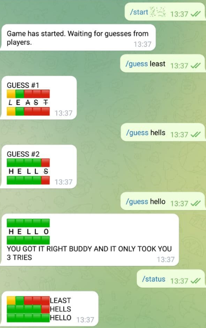

# WORDLE/LINGO TELEGRAM BOT
## Purpose
This is a simple telegram chatbot that allows groups of friends to play the fun game popularized by lingo and revitalized by wordle. The objective is simple. One user sets a hidden 5 letter word that the other plays subsequently try to guess. With each guess, the bot will measure how close the guess was to the actual word providing the following clues:

- 🟩 The letter exists and is in the correct position
- 🟨 The letter exists but is not in the correct position
- 🟥 The letter does not exist anywhere in the word

(Note that the bot has been extended to allow words between 4-10 characters)

#### Example

Word to guess: HELLO

Guesses:
1. DRINK - 🟥🟥🟥🟥🟥
2. LEAST - 🟨🟩🟥🟥🟥
3. HELLS - 🟩🟩🟩🟩🟥
4. HELLO - 🟩🟩🟩🟩🟩

## USE
The bot is deployed on heroku and is live! The bot is named **lingowordle_bot**. Simply search it in telegram and play!

#### Commands

- /start [word] - [word] must be a 4-10 letter word stylized as spoiler text
- /guess [word] - [word] must be a letter word with length of that of the set word
- /status - outputs all guesses made so far as well as their results
- /addlang [language] - Add a language to the set of allowable words. English and Italian supported. If no language is set, English will be used by default.
- /dellang [language] - Delete a language to the set of allowable words. English and Italian supported.
- /seelangs - See all active languages

#### Screenshot of use

