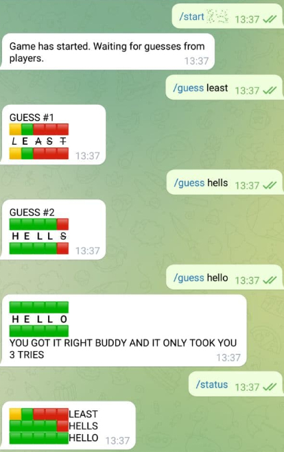

# WORDLE/LINGO TELEGRAM BOT
## Purpose
This is a simple telegram chatbot that allows groups of friends to play the fun game popularized by lingo and revitalized by wordle. The objective is simple. One user sets a hidden 5 letter word that the other plays subsequently try to guess. With each guess, the bot will measure how close the guess was to the actual word providing the following clues:

- 🟩 The letter exists and is in the correct position
- 🟨 The letter exists but is not in the correct position
- 🟥 The letter does not exist anywhere in the word

#### Example

Word to guess: HELLO

Guesses:
1. DRINK - 🟥🟥🟥🟥🟥
2. LEAST - 🟨🟩🟥🟥🟥
3. HELLS - 🟩🟩🟩🟩🟥
4. HELLO - 🟩🟩🟩🟩🟩

## USE
The bot is deployed on heroku and is live! The bot is named **lingowordle_bot**. Simply search it in telegram and play!

#### Commands

- /help - Provides info about the available commands
- /start [word] - Set the word for the game and have your friends guess it. The word must be stylized as spoiler text so your friends don't see it!
- /guess [word] - Guess the word.
- /status - See all guesses so far and their results.

#### Screenshot of use

